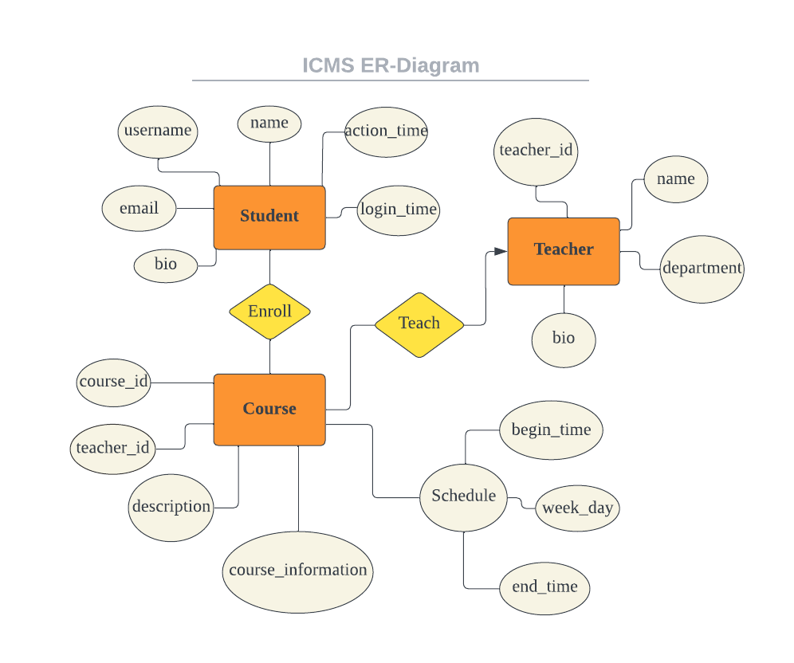

# COMP3278_CourseManagementSystem
Group Project for COMP3278

## Introduction

[TODO]

### Data Structure



### Features

* Face Recognition-based Login and Authentication System 
* Fully interactable course selection / removal system with a full fledged Course Timetable for easy visualization
* Detecting and informing details on upcoming courses (in one hour to be precise)
* Full list of Courses 
### Design of URLs and Parameter

* Login Page: `http://host-address/manager/login/`
* Course Timetable: `http://host-address/manager/curriculum/`
* Course List: `http://host-address/manager`
* Course Detail: `http://host-address/manager/course/?course-id={{ course_id }}`

## How to Start

1. Install all requirement package using conda

```bash
conda create -n comp3278 python=3.11
pip install -r requirements.txt
```

2. Database settings

Set up your Database server(make sure the server has proper support with django). It's recommended to use a new empty database to avoid migration problems.

Under `courseManager/settings.py` set your database information,

by default, the settings are.
```python
DATABASES = {
    "default": {
        "ENGINE": "django.db.backends.mysql",
        "NAME": "CourseManager",
        "USER": "root",
        "PASSWORD": "123456",
        "HOST": "localhost",
        "PORT": "5432",
    }
}
```
next, perform the migrations.
```bash
python manage.py migrate
```

3. Run the server

```bash
python manage.py runserver
```

4. Add user data

* Add user face data:
  * run `manager/face_data.py` to collect the data and train the model
* Add user course data:
  * @Haoyu to finish it
  
## How to add our sample data to database(need refining)
- under the project folder, enter django shell with ```python manage.py shell```
- run the corresponding data python file(Course_data.py, Schedule_data.py etc.) in the shell, for example ```exec(open('Schedule_data.py').read())```

## Add your face data

0. Unzip our existing [dataset](https://drive.google.com/file/d/1mhWGQm_pGOPZohD24spFRHFVY-Nh__oC/view?usp=sharing) under into `manager/data`.

1. If you want, you can create your own face data under `manager` directory

   * Step 1: Modify the `manager/face_data.py`, then run the code to collect the data

     ```python
     if __name__ == "__main__":
         capture_data(user_name="UID YOU WANT")
         # train_model("data/data", "data")
     ```

   * Step 2: Modify the `manager/face_data.py`, then run the code to train the model

     ```python
     if __name__ == "__main__":
         # capture_data(user_name="UID YOU WANT")
         train_model("data/data", "data")
     ```
